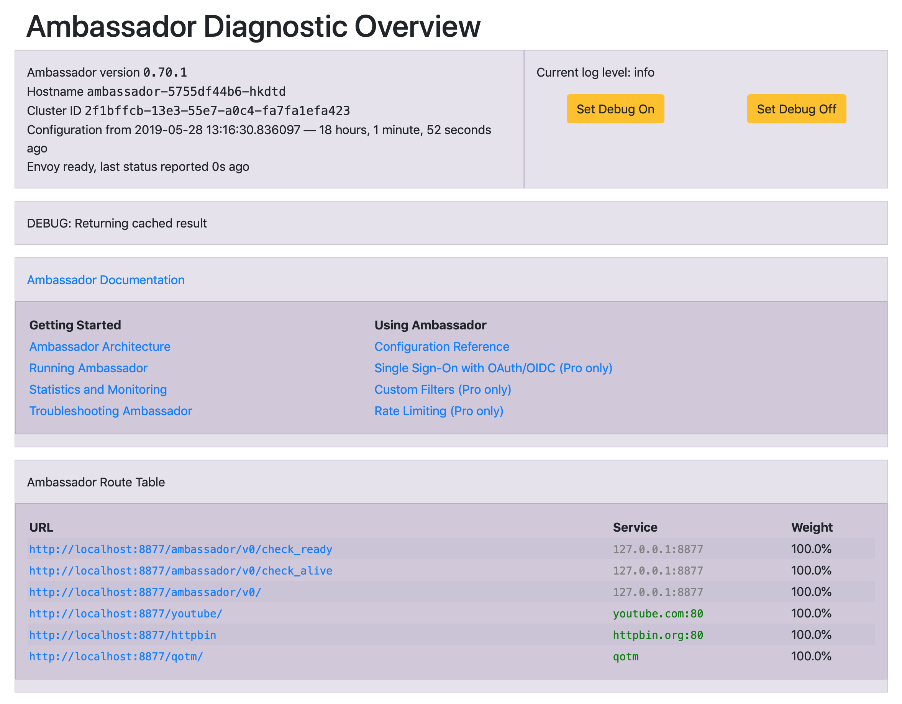

# Enabled Ambassador gateway in k8s cluster
## 1. Create aks in azure
You can do this in azure portal

## 2. Connect aks cluster with kubectl
```
az login
az aks get-credentials --resource-group group_name --name cluster_name
kubectl version
```

## 3. check if cluster has RBAC enabled
```
kubeclt api-versions
```

If you see something like `rbac.authorization.k8s.io/v1` in it then RBAC is enabled

## 4. Deploy Ambassador
```
$ kubectl apply -f https://getambassador.io/yaml/ambassador/ambassador-rbac.yaml
service/ambassador-admin created
clusterrole.rbac.authorization.k8s.io/ambassador created
serviceaccount/ambassador created
clusterrolebinding.rbac.authorization.k8s.io/ambassador created
customresourcedefinition.apiextensions.k8s.io/authservices.getambassador.io created
customresourcedefinition.apiextensions.k8s.io/mappings.getambassador.io created
customresourcedefinition.apiextensions.k8s.io/modules.getambassador.io created
customresourcedefinition.apiextensions.k8s.io/ratelimitservices.getambassador.io created
customresourcedefinition.apiextensions.k8s.io/tcpmappings.getambassador.io created
customresourcedefinition.apiextensions.k8s.io/tlscontexts.getambassador.io created
customresourcedefinition.apiextensions.k8s.io/tracingservices.getambassador.io created
```

From above the output you see list of resources have been created after the installation.

## 5. Create Ambassador load balancer so we can access from external
Run below the command to create Ambassador load balancer
```
$ kubectl apply -f ambassador-loadbalancer.yaml
```

After than, keep running below the command till you see `EXTERNAL-IP` is generated
```
$ kubectl get svc -o wide ambassador
NAME         TYPE           CLUSTER-IP   EXTERNAL-IP     PORT(S)        AGE   SELECTOR
ambassador   LoadBalancer   10.0.65.32   52.183.39.233   80:30958/TCP   36m   service=ambassador
```

## 6. Create routing to test the Ambassador mapping
I have created `mapping-to-sites.yaml` file within the folder which contains 2 redirections, one to httpbin.org and one to youtube.com. Run below the command to create them
```
$ kubeclt apply -f mapping-to-sites.yaml
```

Then you can access below the 2 urls in browser and see it redirect you to target host sites.
```
52.183.39.233/httpbin/
52.183.39.233/youtube/
```
And, DON'T forget the tailing `/`.

## 7. Create a in cluster service and try the mapping
```
$ kubectl apply -f qotm-1.3.yaml
```

Then curl the service
```
$ curl 52.183.39.233/qotm/
{"hostname":"qotm-745c9bfd-g44zh","ok":true,"quote":"Nihilism gambles with lives, happiness, and even destiny itself!","time":"2019-05-29T07:16:01.113512","version":"1.3"}
```

## 8. Headers annotation
Previously we have Ambassador routing `/qotm/` mapping to qotm 1.3 service. now to simulate a blue/green deploy, I am going to deploy qotm 1.7 version and trying to map the same routing to qotm 1.7 service only when the request has a special header `x-bvt`.
```
$ kubectl apply -f qotm-1.7.yaml
```

Above the applied yaml contains qotm17 service with annotation
```
  prefix: /qotm/
  service: qotm17
  headers: 
    x-bvt: true
```

The headers annotation `x-bvt: true` tells Ambassador to send all requests with `x-bvt` header to service qotm17, otherwise, to qotm13.

Now lets curl it and try out.
```
$ curl -H "x-bvt:y" 52.183.39.233/qotm/
{"hostname":"qotm17-5bdd674569-qjq8b","ok":true,"quote":"A late night does not make any sense.","time":"2019-05-29T20:20:27.936516","version":"1.7"}
```

And if we curl it without the header, we will hit qotm 1.3
```
$ curl 52.183.39.233/qotm/
{"hostname":"qotm-58cbdcbd9c-j5kgq","ok":true,"quote":"A small mercy is nothing at all?","time":"2019-05-29T20:20:00.777159","version":"1.3"}
```


## x. Enable the Diagnostics dashboard

Ambassador includes an integrated diagnostics service to help with troubleshooting. By default, this is not exposed to the Internet. To view it, we'll need to get the name of one of the Ambassador pods:

```
$ kubectl get pods
NAME                                       READY   STATUS    RESTARTS   AGE
ambassador-5755df44b6-hkdtd                1/1     Running   0          18h
ambassador-5755df44b6-t22wn                1/1     Running   0          18h
ambassador-5755df44b6-zb7j6                1/1     Running   0          18h
```

Forwarding local port 8877 (or any other port you want) to one of the pods:

```
kubectl port-forward ambassador-3655608000-43x86 8877
```

Then we can view the diagnostics at http://localhost:8877/ambassador/v0/diag/.




## References
> [Ambassador quick start](https://www.getambassador.io/user-guide/getting-started/)  
[Ambassador mapping](https://www.getambassador.io/reference/mappings/)  
[Ambassador headers annotation](https://www.getambassador.io/reference/headers/#headers) 
